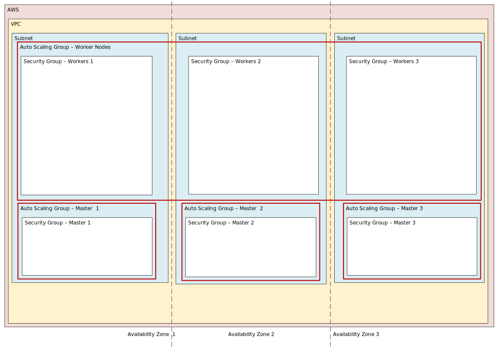
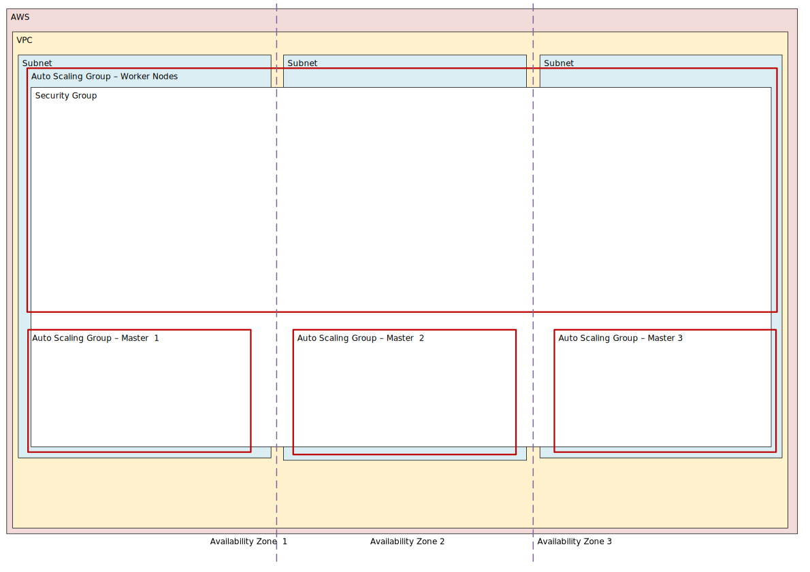

```
TODO:
- Pods
- Kubernetes' concept of Services
- Get rid of other uses of the word ‘services’
- Namespaces
- Closing notes on management: kubeclt
```

_NOTE: I am far from a Kubernetes expert. This guide was written based on an
introduction given by [Jakub Scholz](https://github.com/scholzj). This is
something I wrote so as to not forget it._

This is a diagramatic and codeless introduction to Kubernetes. Diagramatic
means that the guide should be good at showing the overall architecture and
communication flow in a high availability Kubernetes setup. Codeless meaning
that the guide does not actually show how to perform anything, it only shows
how things work conceptually. It also skips quite a lot, maybe too much, but
hopefully not to get an understanding.

So what is Kubernetes (k8s)[^1]?

In short, it is something that helps you deploy and run high availability
containerised applications in the cloud (be that with a provider or on your own
infrastructure). It does this through various mechanisms explained on the
landing page of [Kubernetes' website](https://kubernetes.io/), but the core of
it is that running applications in a cloud poses unique problems and
opportunities that Kubernetes addresses and leverages. Hopefully, this primer
will show you what those are.

A small note before starting: this page is hosted [on GitHub](https://github.com/zmlka/undisciplinary). 
Feel free to give feedback, suggestions or corrections there.

With that, let's go.

## Overall Architecture and Resource Overview

### First, a Cloud

We'll explain how Kubernetes does its thing by "building up" the related
infrastructure and processes, so let's start with a clean slate: ☁️a cloud☁️. For
our purposes we'll be drawing how one of our applications is set up in AWS.
However, the one of the magics of Kubernetes is that it is [largely agnostic](https://kubernetes.io/docs/setup/pick-right-solution/) 
to where you chose to deploy.

### Virtual Private Cloud and Availability Zones

[](img/Kubernetes_big_picture_03.svg)

Within AWS we have our own Virtual Private Cloud (VPC), our "own" sectioned out
network within Amazon's larger network.

More specific to AWS is the choice of _Regions_ and _Availability Zones_.
Regions are the general geographical areas where Amazon's data centres are (eg:
London, Frankfurt), and Availability Zones (AZ) are the individual data centres
within those regions.

Ideally, you want your applications distributed across different Availability
Zones within your chosen region in case anything goes wrong in one Availability
Zones. For our High Availability Kubernetes example, we will be using 3.

### Subnets, Auto Scaling Groups and Security Groups

[](img/Kubernetes_big_picture_02.svg)

In each Availability Zone, we have a subnet that the Kubernetes cluster will be
placed in as you can't have subnets across Availability Zones.

Next up are Auto Scaling Groups (ASG). Auto Scaling Groups are a mechanism that
allows you to set conditions under which resources are spun up or down
depending on current demand. Scaling is a core «cloud» concept at the very
heart of what allows Kubernetes to be effective.

It takes advantage of the speed and ease with which you can provision
infrastructure these days, turning them into a disposable commodity. When
procuring infrastructure is a question of minutes, it makes sense to have your
systems dynamically change depending on the current situation. You no
longer have to have a static setup waiting for peak conditions, instead your
setup is always adjusting to actual loads.

For example, if during peak processing times your Virtual Machines (EC2
instances) are running out of RAM, Auto Scaling will spin up more EC2
instances to take off the load. When the capacity is not needed, the new EC2
instances will be turned off.


Notice that in our diagram the «Worker» Auto Scaling Group is going across all
three Availability Zones, while the «Master» Auto Scaling Groups are bound to
one Availability Zone each.

This is because we _want_ containers running on Worker nodes to be
horizontally scaled across Availability Zones in case of failure or expansion.
However, we restrict the Master Auto Scaling Groups to be local to Availability
Zones, ie: we don't want Masters form one Availability Zone to fail over to
another Availability Zone. Why? Imagine if you had the Master Autos Scaling
Group set up across all Availability Zone. Then, after a succession of local
Availability Zone failures, you could end up in a situation where you'd either
have no master in one Zone, or, even worse, all your masters in a single Zone.

Security Groups (SG) are something like a basic firewall. You can determine
which ports you can use to cross them. Currently, we use one for the whole
cluster, but are considering having two - one for the Masters and one for the
Workers, as the masters need more ports open to communicate with them, allowing
you to set a more restrictive policy for Workers.

### Masters, Workers and Resources

[](img/Kubernetes_big_picture_01.svg)

Kubernetes has two types of entities: Masters and Worker nodes. We will get
into the internals of each in a little bit, but in essence the core roles that
they fulfil are:

* Masters nodes: manage, coordinate, control, schedule.
* Worker nodes: [work work](https://www.youtube.com/watch?v=eO6OaVnbqaY)

A Master is essentially the «brain» or «manager» of the act of deploying and
scaling applications that you have running within a Kubernetes cluster. It
keeps track of the current state of the cluster, compares it to the desired
state, and makes changes as necessary. That's _Orchestration_.

As the Master is in it's own Auto Scaling Group, if it will fail AWS will
boot up a replica EC2 of it, the Elastic Load Balancer will take note of it,
and a few minutes later life will go on. Mounted on the Master is Elastic Block
Storage with a clustered key-value store (etcd) that Master nodes use as the
central store of information about about the state and configuration of the
cluster. If this cluster goes down, you better have a backup. Without an
accurate etcd you can plan to rebuild your cluster from scratch.

The Worker nodes on the other hand, mainly do what they are told. They host
applications (in containers), mount storage needed by those applications, route
information between applications, and report back to the Master.

In terms of roles and permissions, obviously Worker nodes don't need much.
Master nodes need the ability to spin up and down new Workers (EC2 isntancs),
create and destroy storage for them (EBS), and interact with the DNS for
setting host names (Route53).

### The big picture

[](img/Kubernetes_big_picture_00.svg)


Adding what communicates with what, the picture is now complete. Next we will
over the components/services that make up Masters and Workers in detail.

## Master and Worker Internals

[](img/Kubernetes_master_worker_detail.svg)

Note that the example being explained is what we are using, which is not a
minimum install or a default. It's what works for us, but it means that there
are some additional services (‘addons’). In general the Docker + Kubelet
bootstrap the core Kubernetes services (coloured in pink), after which the API
Server will request the Kubelet to start additional ‘addon’ services (coloured
in yellow). Except for Kubelet and Docker itself, all components are Docker
containers.

All communication within and between the Master/Worker is request-response,
TLS. The TLS certificates are self-managed by Kubernetes, with no option (save
for some very very hacky approaches) for managing them externally.

The diagram offers a TLDR of the key information about each component. Below is
a bit more detail.

<!--
The detailed workings within Masters and Workers are surely still the big
unknown.
Sources for writing more details:

- Services and what does Kube-proxy do?
  - https://kubernetes.io/docs/concepts/services-networking/service
- Cluter Networking:
  - https://kubernetes.io/docs/concepts/cluster-administration/networking/
- HA
 - https://github.com/bloomberg/kubernetes-cluster-cookbook/wiki/Cluster-High-Availability
 - https://kubernetes.io/docs/tasks/administer-cluster/highly-available-master/#implementation-notes
- Communication within cluster
 - https://kubernetes.io/docs/concepts/architecture/master-node-communication/#master---cluster
- DNS Pods and Services
 - https://kubernetes.io/docs/concepts/services-networking/dns-pod-service/
- Kubernetes Components
 - https://kubernetes.io/docs/concepts/overview/components
-->
### Master

As can be seen in the diagram, Master nodes can scale horizontally, but not all
components on them do. In fact, only the API Server scales, other core
components are active on one instance only.

Components:

- **etcd:** Key value database for cluster configuration and state. As outlined
  above, if this dies without backup you can scrap the cluster.
- **API Server:** All communication within and without the Master is routed
  through the API server. The various other components of the Master talk to
  the API server, not to themselves.
- **Controller Manager:** Regularly checks, through the API Server, the current
  state of the cluster and compares it to the desired state. If it notes a
  discrepancy, it will inform the API Server to schedule a change.
- **Scheduler:** Schedules when a gap between the actual and desired state is
  bridged on Worker nodes.
- **Cluster Auto Scaler:** (addon) Checks the balance of Auto Scaling Groups,
  resource usage and availability zones. Calls API server to make changes in
  desired vs actual if needed. As each application (container) has
  resource limits stored in Kubernetes' configuration, the Cluster Auto Scaler
  will, for example, notice that Application 1 has hit it's CPU usage limit and
  will inform the API Server that at new instance of Application 1 should be
  started.
- **External DNS:** (addon) Changes entries in AWS' Route53 if needed.
- **Calico:** (addon) Software defined network. We like it because it allows you to
  set egress policy for individual containers, not just Kubernetes' default
  ingress policies, allowing for stronger security on clusters that operate a
  whole host of applications.
- **Kubelet:** Basic Kubernetes service that triggers the start of Kubernetes
  services on the Master/Worker.
- **Docker:** While Kubernetes supports multiple container runtimes, [Docker is recommended](https://kubernetes.io/docs/concepts/workloads/pods/pod/).
  With the exception of Docker and Kubelet, all services and applications
  running in the clusters are containers.

### Worker

Components:

- **Kube Proxy:** Similarly to the API Server, is the communication hub within
  and without the Worker.
- **DNS:** (addon) Internal DNS for the cluster.
- **Heapster:** (addon) Cluster monitoring and performance analysis service.
- **Dashboard:** (addon) Web based monitoring of the cluster.
- **Calico:** (addon) As above
- **Kubelet:** As above, reports to the Master with, asks the Master what
  services and applications should be running on the Worker, 
- **Docker:** As above

## Closing notes

... 

### Notes on deployment

Basically, every step describing the above infrastructure is provisioned
through Terraform, which, towards the end of its run will use Ansible templates 
to configure the Kubernetes cluster.


[^1]: Kubernetes -> k`12345678`s -> k8s
