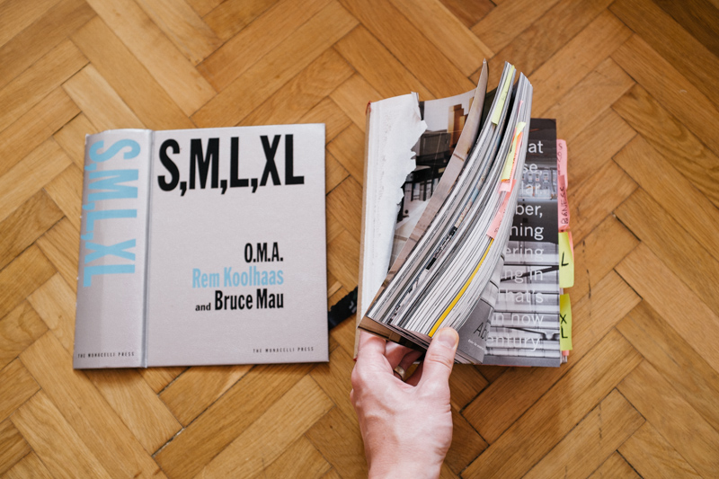
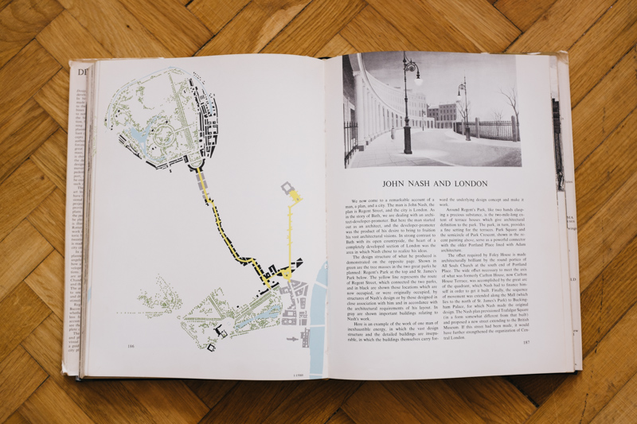
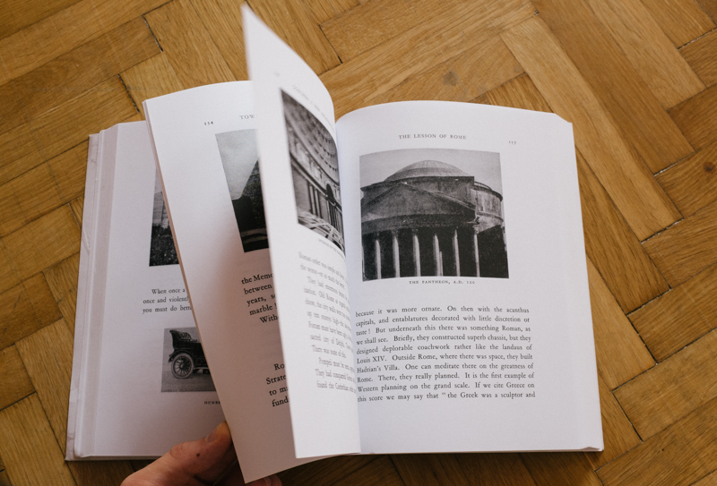
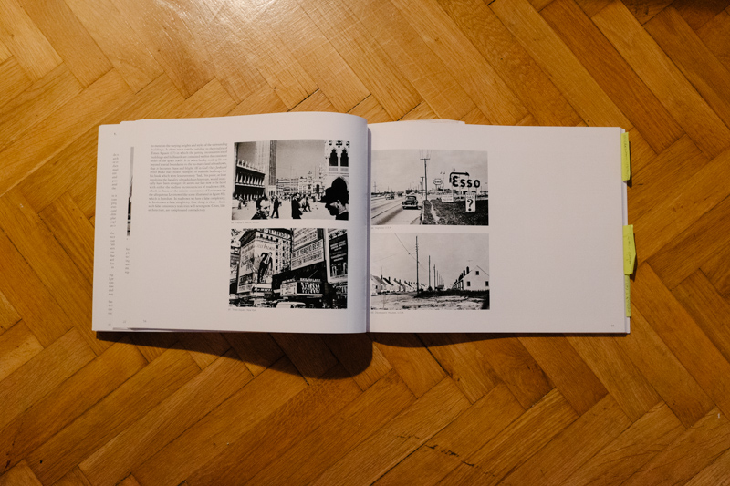
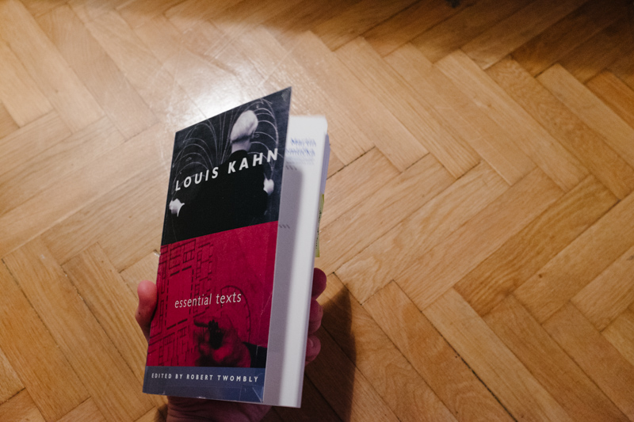
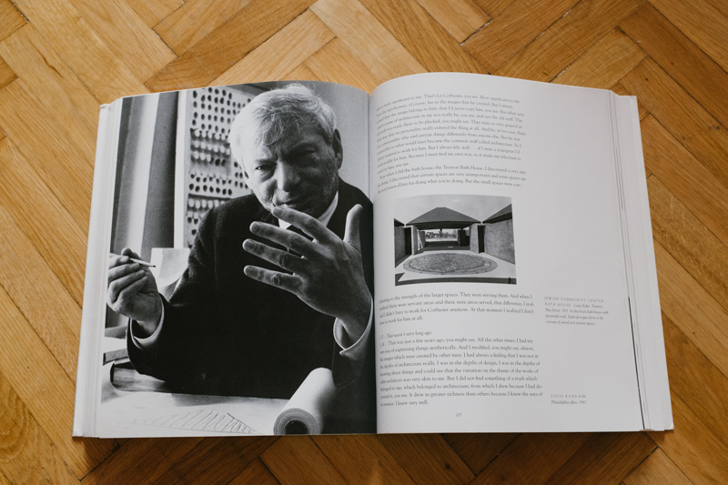
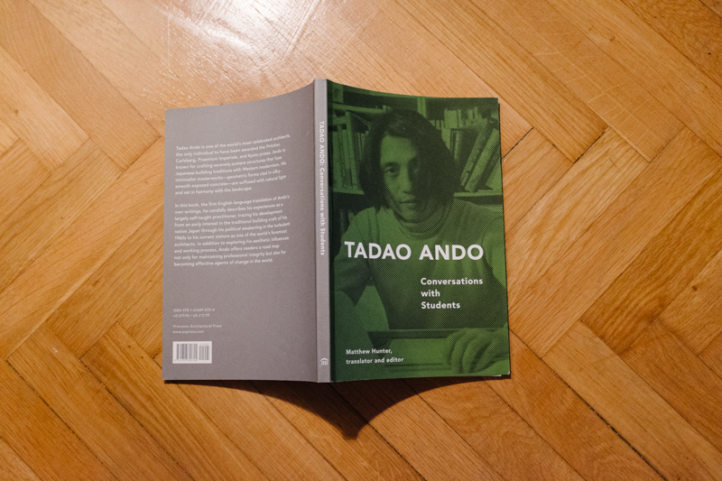

I've been out and about architecture for a while.

I frequently am asked to give book recommendations, and frequently see people
asking for book recommendations on the internet. In this overview, I'll compile
some of my answers.

## Introduction

I used to run an architecture themed reading[^atrap] group while still in
architecture school.

The reading group grew out of a frustration that as students of architecture
whose task it was to design buildings relevant to the present, did not have a
platform to discuss present contemporary architecture. History classes start
with Egypt, meaning that you only cover the 20th century in your last year of
studies There is nothing wrong with the way history is taught, but it means
that, for the majority of students, exposure to contemporary architecture lies
solely in the hands of a few resources of questionable quality (archi-spam
blogs especially).

The reading group, then, had a double mission of reflection on what's going on
now, and at the same time providing the tools necessary to be able to have the
discussion: a knowledge of 20th century architecture. There was [an
introduction](http://atrap.org/about.html), a list of
[principles](http://atrap.org/principles.html) and a
[curriculum](http://atrap.org/curriculum.html).

If there is one thing to stress from those three pages, it is from the
principles page:

> Primary texts meaning texts that are 0 degrees of separation from the subject
> matter. This means that we concentrate on texts written by architects that
> explain what they were doing, or texts written by theorists which then went
> on the inform what architects were doing. We look at texts that are of the
> time when they were relevant, not recapitulations and interpretations of
> secondary actors on the work of others.

On to the lists then.

## Frequently recommended books

I don't like the idea of a must have list, everyone can chose what to read, but
these are books that I believe are of such high quality, importance or
usefulness that they can only bring merit. These books should be good presents
for any architect.

### Books by Architects

#### S, M, M, XL by OMA (Rem Koolhaas)

Amazon: [UK](http://www.amazon.co.uk/gp/product/1885254865/ref=as_li_tl?ie=UTF8&camp=1634&creative=19450&creativeASIN=1885254865&linkCode=as2&tag=zmlka-21&linkId=OJRQYJHV2U3T3EGY) 
and [US](http://www.amazon.com/gp/product/1885254865/ref=as_li_tl?ie=UTF8&camp=1789&creative=390957&creativeASIN=1885254865&linkCode=as2&tag=wwwzmlkacom-20&linkId=2E4U57GWC6ZAIGH7)

That's a picture of the battered state of my copy after five years.

First enjoyed S, M, L, XL even before starting architecture studes, and still
flip through it regularly. Creating this tome was a massive undertaking for
OMA, as is reading it, but it is worth it. Within the profession, it is assumed
that you are familiar with the book, the projects, essays and critiques in it.
Koolhaas, having been a journalist and scriptwriter prior to becoming an
architect, writes well, and his style of rhetoric is a welcome contrast to
archispeak.

#### Design of Cities by Edmund Bacon

Amazon: [UK](http://www.amazon.co.uk/gp/product/0140042369/ref=as_li_tl?ie=UTF8&camp=1634&creative=19450&creativeASIN=0140042369&linkCode=as2&tag=zmlka-21&linkId=HMB4I5ZOP4CBYUMY) 
and [US](http://www.amazon.com/gp/product/0140042369/ref=as_li_tl?ie=UTF8&camp=1789&creative=390957&creativeASIN=0140042369&linkCode=as2&tag=wwwzmlkacom-20&linkId=LVOMIQ6GEECNYPWU)

_The Design of Cities_ is exceptionally well structured book on urban design.
Following the travels and learnings of the author, the book is a sequence of
case studies on canonical acts of urbanism. The book stands out for its clarity
of writing but above all its diagrams. Burke's diagrams typically use three
colours at most,  are hand drawn showing only selective information,  perfectly
illustrating the point being made. It diagrams and explains urban principles in
cities starting from Roman camps all the way to modern Philadelphia, which thde
author worked on.

This book works both for those unfamiliar with urban design as well as for
those already versed in it. The diagrams alone make good case studies of how to
convey information.

#### Toward an Architecture by Le Corbusier

Amazon [UK](http://www.amazon.co.uk/gp/product/0711228094/ref=as_li_tl?ie=UTF8&camp=1634&creative=19450&creativeASIN=0711228094&linkCode=as2&tag=zmlka-21&linkId=C3SU6Q5PJVWUZ5VX) 
and [US](http://www.amazon.com/gp/product/0892368225/ref=as_li_tl?ie=UTF8&camp=1789&creative=390957&creativeASIN=0892368225&linkCode=as2&tag=wwwzmlkacom-20&linkId=J5DQ3IRDEN6J5IM3)

There are a couple of translations but be sure to get the John Goodman one
linked above.

In the 20th century, no architect has such referential gravity as Le Corbusier.
While he might not be the most talked about at any given moment, it is his
buildings and writings that managed to capture and inspire much of the
development of architectural thinking in the first half of the century.

Much is said about him, yet most have not even read this short manifesto that
serves as an entry point to making sense of European architecture after World
War I.

#### Complexity and Contradiction in Architecture by Robert Venturi

Amazon [UK](http://www.amazon.co.uk/gp/product/0870702823/ref=as_li_tl?ie=UTF8&camp=1634&creative=19450&creativeASIN=0870702823&linkCode=as2&tag=zmlka-21)
and [US](http://www.amazon.com/gp/product/0870702823/ref=as_li_tl?ie=UTF8&camp=1789&creative=390957&creativeASIN=0870702823&linkCode=as2&tag=wwwzmlkacom-20)

Vincent Scully, in his  introduction to _Complexity and Contradiction_,
announced that this is the most important book in architecture since Le
Cobrusier's _Towards an Architecture_. This seemingly outlandish statement by
one of the most eloquent architectural historians ever turned out to be true. 

The book is, simply put, very good and a must read. I won't go into the details
of its contents as those can be easily elsewhere, but suffice it to say that
its influence is difficult to overstate. It allows one to understand
developments in architecture in an entirely different way than before reading
it. The book develops your ability to think about buildings.

#### Louis Kahn: Essential Texts

Amazon [UK](http://www.amazon.co.uk/gp/product/0393731138/ref=as_li_tl?ie=UTF8&camp=1634&creative=19450&creativeASIN=0393731138&linkCode=as2&tag=zmlka-21)
and [US](http://www.amazon.com/gp/product/0393731138/ref=as_li_tl?ie=UTF8&camp=1789&creative=390957&creativeASIN=0393731138&linkCode=as2&tag=wwwzmlkacom-20)

Never has Louis Kahn been more popular[^popular].

The selection of texts, discussions and lectures in this book is comprehensive,
collecting pieces from 1944 till 1973, meaning that practically everything you
would want is in the book. As with some of the other books suggested, this one
nicely maps the progression in thinking that Kahn underwent, with the first
piece being written before his stay at the American Academy in Rome.

The current popularity of Kahn is founded on an image of him as a «Great
Architect», rightfully so. Yet this is only half the story. After all, for
example, The Parliament of Bangladesh was finished many years after his death.
By not being familiar with Kahn's thoughts you miss out on why people paid
attention to him in the first place.

### Books of interviews and lectures

Architects often present their work in devious ways.

Anybody who has been through any design course of any kind knows the tremendous
quantity of half-truths and straight-up inventions that are said during crits,
and this spirit of rhetorical invention is often carried forward into
professional life. Design ideas are often retconed, initial sketches drawn
last, foundational diagrams drawn post-factum. Designers are paradoxically
extremely honest and extremely dishonest at the same time.

Reading interviews is sometimes a nice antidote; it feels more real, gives more
of an idea of the actual principles of the person being interviewed. That is
not to say that the stated principles are followed by them when designing, but
it definitely makes for a more engaging read than the usual PR sounding
descriptions. Not to mention secondary reading which does all that and more.

#### Talking Architecture

Amazon [UK](http://www.amazon.co.uk/gp/product/3791346849/ref=as_li_tl?ie=UTF8&camp=1634&creative=19450&creativeASIN=3791346849&linkCode=as2&tag=zmlka-21)
and [US](http://www.amazon.com/gp/product/3791340131/ref=as_li_tl?ie=UTF8&camp=1789&creative=390957&creativeASIN=3791340131&linkCode=as2&tag=wwwzmlkacom-20)

Hanno Rauterberg is a journalist mainly working for the German weekly _Die
Zeit_. This book contains a collection of interviews with architects, most of
whom would fall under the label of «starchitect» that he conducted over
the course of a few years.

The value of this compendium comes from the fact that all the interviews were
conducted by the same person, meaning that the topics covered with various
interviewees are frequently linked, and its brevity. No interview is longer
than six pages, yet you always learn something. Hanno Rauterberg uses his
knowledge of the contemporary architecture scene to ask what's important and
what is not usually asked.

#### The Oral History of Modern Architecture

Amazon [UK](http://www.amazon.co.uk/gp/product/0810936690/ref=as_li_tl?ie=UTF8&camp=1634&creative=19450&creativeASIN=0810936690&linkCode=as2&tag=zmlka-21)
and [US](http://www.amazon.com/gp/product/0810936690/ref=as_li_tl?ie=UTF8&camp=1789&creative=390957&creativeASIN=0810936690&linkCode=as2&tag=wwwzmlkacom-20)

The sub-title of the book is _interviews with the greatest architects of the
twentieth century_, which, considering that the book contains extracts from
interviews conducted with some 70 architects, is fitting. As with Rauterberg's
book, the interviews were all conducted by one individual, John Peter.

The structure of the book is somewhat awkward, as the first half is organised
by thematic chapters that contain extracts and quotes from various architects
on particular themes, those being: technology, society, art and great works.
The second half of the book contains full transcripts of interviews with ten
architects. Also included is a CD that contains some more interview material.
The thematic quotes are fine, but the full interviews is the real juice of the
book, and it makes a nice complement to Rautberg's book as Peter interviews
architects of a prior generation.

Considering the scope of the book and the price it goes for, it is a very good
deal.

#### Tadao Ando: Conversations with Students

Amazon [UK](http://www.amazon.co.uk/gp/product/1616890703/ref=as_li_tl?ie=UTF8&camp=1634&creative=19450&creativeASIN=1616890703&linkCode=as2&tag=zmlka-21)
and [US](http://www.amazon.com/gp/product/1616890703/ref=as_li_tl?ie=UTF8&camp=1789&creative=390957&creativeASIN=1616890703&linkCode=as2&tag=wwwzmlkacom-20)

I have found that Tadao Ando is almost universally liked, or at least
universally not disliked. Sometimes I speculate that this might have something
to do not only with his architecture, which is very «architectonic», but also
with his relative absence from the discourse. While many books are published
about Ando, very few pick apart his brain. This one does so quite well.

Written in the first person, it traces through his growth (the first chapter is
entitled “Origins”) in a very intimate way. For many architects, once they
reach mid-career they cease evolving their architecture, and the same could be
said of Ando, who has been drawing the same building his entire life, you can
almost tell from this book, which is an extremely gentle read. This does not
make it boring, when you line up the facts, Ando's career, or at least its
foundations, are quite unorthodox.

The entire "Conversations" series is well worth a browse. 
Calatrava ([UK](http://www.amazon.co.uk/gp/product/1568983255/ref=as_li_tl?ie=UTF8&camp=1634&creative=19450&creativeASIN=1568983255&linkCode=as2&tag=zmlka-21), 
[US](http://www.amazon.com/gp/product/1568983255/ref=as_li_tl?ie=UTF8&camp=1789&creative=390957&creativeASIN=1568983255&linkCode=as2&tag=wwwzmlkacom-20&linkId=O5LEX6TT2HSKDRJ3)), 
Le Corbusier ([UK](http://www.amazon.co.uk/gp/product/1568981961/ref=as_li_tl?ie=UTF8&camp=1634&creative=19450&creativeASIN=1568981961&linkCode=as2&tag=zmlka-21), 
[US](ttp://www.amazon.com/gp/product/1568981961/ref=as_li_tl?ie=UTF8&camp=1789&creative=390957&creativeASIN=1568981961&linkCode=as2&tag=wwwzmlkacom-20&linkId=YHRP4SINDIPWL7LP)), 
Louis Kahn ([UK](http://www.amazon.co.uk/gp/product/156898149X/ref=as_li_tl?ie=UTF8&camp=1634&creative=19450&creativeASIN=156898149X&linkCode=as2&tag=zmlka-21), 
[US](http://www.amazon.com/gp/product/156898149X/ref=as_li_tl?ie=UTF8&camp=1789&creative=390957&creativeASIN=156898149X&linkCode=as2&tag=wwwzmlkacom-20&linkId=XYLQNWHFMKBKSQVT)), 
Rem Koolhaas ([UK](http://www.amazon.co.uk/gp/product/1885232020/ref=as_li_tl?ie=UTF8&camp=1634&creative=19450&creativeASIN=1885232020&linkCode=as2&tag=zmlka-21), 
[US](http://www.amazon.com/gp/product/1885232020/ref=as_li_tl?ie=UTF8&camp=1789&creative=390957&creativeASIN=1885232020&linkCode=as2&tag=wwwzmlkacom-20&linkId=3UFRC3RAJBZCBQVL)), 
Iam McHarg ([UK](http://www.amazon.co.uk/gp/product/1568986203/ref=as_li_tl?ie=UTF8&camp=1634&creative=19450&creativeASIN=1568986203&linkCode=as2&tag=zmlka-21), 
[US](http://www.amazon.com/gp/product/1568986203/ref=as_li_tl?ie=UTF8&camp=1789&creative=390957&creativeASIN=1568986203&linkCode=as2&tag=wwwzmlkacom-20&linkId=KBFIHNRVCHKKZIUE)), 
Mies van der Rohe ([UK](http://www.amazon.co.uk/gp/product/1568987536/ref=as_li_tl?ie=UTF8&camp=1634&creative=19450&creativeASIN=1568987536&linkCode=as2&tag=zmlka-21), 
[US](http://www.amazon.com/gp/product/1568987536/ref=as_li_tl?ie=UTF8&camp=1789&creative=390957&creativeASIN=1568987536&linkCode=as2&tag=wwwzmlkacom-20&linkId=QWOBRJBKK23LMUSF)), 
Frei Otto ([UK](http://www.amazon.co.uk/gp/product/1568988842/ref=as_li_tl?ie=UTF8&camp=1634&creative=19450&creativeASIN=1568988842&linkCode=as2&tag=zmlka-21), 
[US](http://www.amazon.com/gp/product/1568988842/ref=as_li_tl?ie=UTF8&camp=1789&creative=390957&creativeASIN=1568988842&linkCode=as2&tag=wwwzmlkacom-20&linkId=5ON2HFUVVFXWD54D)), 
Paul Rand ([UK](http://www.amazon.co.uk/gp/product/1568987250/ref=as_li_tl?ie=UTF8&camp=1634&creative=19450&creativeASIN=1568987250&linkCode=as2&tag=zmlka-21), 
[US](http://www.amazon.com/gp/product/1568987250/ref=as_li_tl?ie=UTF8&camp=1789&creative=390957&creativeASIN=1568987250&linkCode=as2&tag=wwwzmlkacom-20&linkId=J3RPNPSWFZHJK2Q6)), 
Peter Smithson ([UK](http://www.amazon.co.uk/gp/product/1568984618/ref=as_li_tl?ie=UTF8&camp=1634&creative=19450&creativeASIN=1568984618&linkCode=as2&tag=zmlka-21), 
[US](http://www.amazon.com/gp/product/1568984618/ref=as_li_tl?ie=UTF8&camp=1789&creative=390957&creativeASIN=1568984618&linkCode=as2&tag=wwwzmlkacom-20&linkId=OLM6HAPUW5MWTGCV)), 
Paolo Soleri ([UK](http://www.amazon.co.uk/gp/product/161689055X/ref=as_li_tl?ie=UTF8&camp=1634&creative=19450&creativeASIN=161689055X&linkCode=as2&tag=zmlka-21), 
[US](http://www.amazon.com/gp/product/161689055X/ref=as_li_tl?ie=UTF8&camp=1789&creative=390957&creativeASIN=161689055X&linkCode=as2&tag=wwwzmlkacom-20&linkId=SJVYWZGCGH5EO2LU)).

[^atrap]: [ATRAP](http://www.atrap.org)

[^popular]: I am writing this as the exhibition Louis Kahn: The Power of Architecture is making its way around the world, a few dozen months after the Four Freedoms Park was opened.

